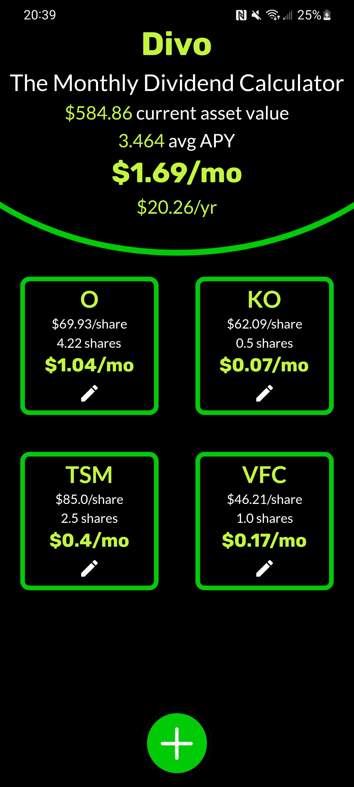
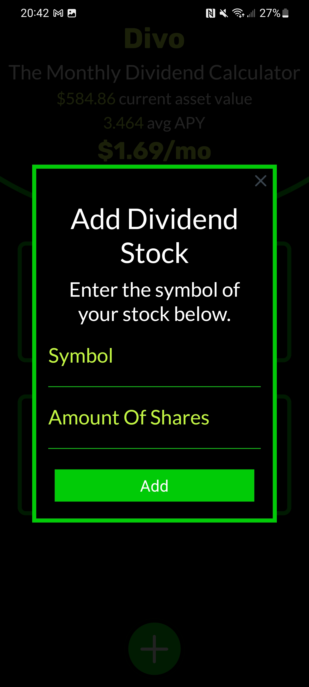

<h1 align="center">
  <br>
  
  <br>
  Divo - Server
  <br>
</h1>

<h4 align="center">A simple yet useful monthly dividend estimate calculator api</h4>

<p align="center">
  <a href="#key-features">Key Features</a> •
<a href="#technologies-used">Technologies Used</a> •
  <a href="#endpoints">Endpoints</a> •
  <a href="#license">License</a>
</p>

<h1 align="center">


</h1>

## Key Features
* Query stock open price
* Query current dividend amount
* Query current dividend rate
* Query dividend amount per month
* Caching functionality


## Technologies Used
* Python
* Flask
* yahoo-finance package
* json
* Caching
* pandas

## Endpoints
```http request
>    /current_div

Returns the latest paid dividend from the stock provided.

  Example request:
    <ip>/current_div?stock=O
    
  Example response:
    0.248
```

```
>    /div_rate

Returns the dividend rate from the stock provided.

  Example request:
    <ip>/div_rate?stock=O
    
  Example response:
    2.97

```

```
>   /open

Returns the open price from the stock provided.

    Example request:
      <ip>/open?stock=O
        
    Example response:
      69.94
```

```
>   /div_rate_monthly

Returns the dividend payout per month
    
    Example request:
      <ip>/div_rate_monthly?stock=O
        
    Example response:
      0.24750000000000003

```
## License

MIT

---
> [zlincoln.dev](https://www.zlincoln.dev) &nbsp;&middot;&nbsp;
> GitHub [@ZacharyLincoln](https://github.com/ZacharyLincoln)

